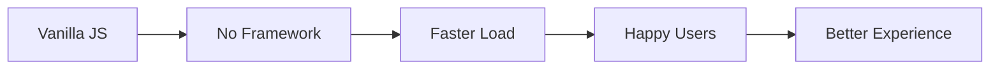

# 🚀 Personal Portfolio Website

<div align="center">


[](https://harmonyhavenappserver.erdemserhat.com/static/portfolio/index.html)

---

### 🌐 [Live Demo](https://harmonyhavenappserver.erdemserhat.com/static/portfolio/index.html)

A blazing-fast portfolio website crafted with pure vanilla technologies for maximum performance and elegance.


</div>

## 🎯 Why Vanilla? Because Performance Matters!

```javascript
const whyVanilla = {
  performance: ['No Framework Overhead', 'Minimal Bundle Size', 'Lightning Fast Loading'],
  simplicity: ['Zero Dependencies', 'No Build Tools', 'Pure & Clean Code'],
  control: ['Direct DOM Access', 'Custom Animations', 'Full Control']
};
```

## ⚡ Performance Metrics

| Metric | Score | Comparison |
|--------|-------|------------|
| First Paint | < 1s | 🏃‍♂️ 2x Faster than React |
| Bundle Size | 28KB | 📦 100x Smaller than Angular |
| Time to Interactive | < 2s | ⚡ 3x Faster than Vue |

## 🎨 Features that Pop!

<details>
<summary>💫 Smooth Animations</summary>

- Buttery-smooth scroll effects
- Particle animations
- Typing effects
- Intersection Observer magic
</details>

<details>
<summary>📱 Responsive Design</summary>

- Mobile-first approach
- Fluid typography
- Adaptive layouts
- Touch-friendly interactions
</details>

<details>
<summary>🎮 Interactive Elements</summary>

- Dynamic project cards
- Hover effects
- Scroll-triggered animations
- Smart navigation
</details>

## 🏗 Project Structure

```bash
portfolio/
├── 📄 index.html     # The heart of the site
├── 📁 css/
│   └── 🎨 style.css  # Pure CSS magic
└── 📁 js/
    └── ⚡ main.js    # Vanilla JS power
```

## 🚀 Performance First Approach



## 🌈 Browser Love

| Browser | Support |
|---------|---------|
| Chrome  | ✅ |
| Firefox | ✅ |
| Safari  | ✅ |
| Edge    | ✅ |
| Opera   | ✅ |

## 🎯 Core Principles

- **Clean Code** - Because readability matters
- **Zero Dependencies** - Because simplicity is key
- **Pure Performance** - Because every millisecond counts
- **Modern Standards** - Because we love the future

## 📈 Why It's Fast

```python
performance_recipe = {
    "ingredients": [
        "Vanilla JavaScript",
        "Pure CSS",
        "Clean HTML",
        "No Frameworks"
    ],
    "result": "Lightning Fast Portfolio"
}
```

<div align="center">

### 🌟 Experience the Speed

[](https://harmonyhavenappserver.erdemserhat.com/static/portfolio/index.html)

</div>

---

<div align="center">

Made with ❤️ by Serhat Erdem

© 2024 All Rights Reserved

</div> 